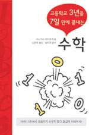

# 수학
- 부제: 고등학교 3년을 7일만에 끝내는
- 대출 군포시립도서관
- 도서 정보
  - 저자: 야나기야 아키라
  - 출판사: Haneon.com
  - 페이지: 366

----
> 수학은 각 기호에 대한 명확한 정의를 암기해야 하고 그 정의에 근거하여 자유자재로 읽을 줄 알아야 한다는 것을 느끼게 되었다.

이 책을 읽고 느낀 점이다.

수학을 다시 시작하기로 마음 먹었을때 가장 어려운 점은 어디서부터 시작할 것인가에 대한 고민을 하게 된다
중학교 교과서나 교재를 볼것인가? 정석을 볼것인가? 시작점을 잡기가 상당히 어렵다. 이런 관점에서 수학의 시작점으로 딱 좋은 책이다.

일본 저서의 특성이 잘 녹아있는 수학책이다.
수학 전체적인 분야를 어렵지 않게 설명하고 무엇보다 간결한 정의가 매우 좋다.

각 수학 분야에 대한 명확하고 간결한 정의를 전달한다.
명확한 정의와 각 정의에 대한 의미를 간결한 예제를 보여주고 의미를 정리하는 방식으로 구성된다.

구성은 다음과 같다

- 수의 체계
- 방정식
- 지수
- 로그
- 삼각비
- 삼각함수
- 경우의 수, 확률
- 수열
- 미분: 접선
- 적분: 면적

주요 범위에 대한 명확한 이미지를 심어주지 좋은 책이다.
2-3일 정도에 정독 가능한 분량이다

수학을 다시 공부해야 겠다고 마음 먹은 개발자나 엔지니어에게 강추하는 책이다

----

